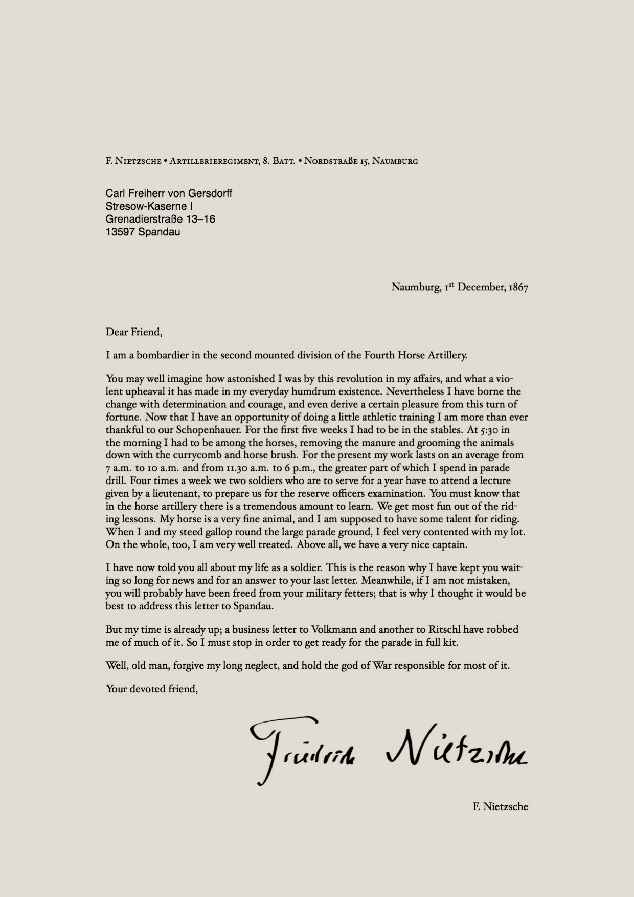

# Letter Boilerplate

A boilerplate to quickly and painlessly generate high-quality letters through LaTeX.

Why settle for MS Word when you can get the job done using your text editor?

## Dependencies

1. LaTeX with the following extra packages: `fontspec` `geometry` `ragged2e` `enumitem` `xunicode` `xltxtra` `hyperref` `polyglossia`
2. [Pandoc](http://pandoc.org/)

To install LaTeX on Mac OS X, I recommend getting the smaller version BasicTeX from [here](https://tug.org/mactex/morepackages.html) and installing the additional packages with `tlmgr` afterwards. Same goes for Linux: install `texlive-base` with your package manager and add the needed additional packages later.

To install pandoc on Mac OS X, run `brew install pandoc`. To install it on Linux, refer to the [official docs](http://pandoc.org/installing.html).

## Getting started

1. Run this in your terminal to clone the repo, move into the right directory and delete all the git stuff:

        git clone git@github.com:mrzool/letter-boilerplate.git && cd letter-boilerplate && rm -rf .git

2. Edit `details.yml` with your details, your recipient's details, and the desired settings.
3. Open `content.md` and write your letter in markdown.
3. Run `make` to compile the PDF.

The template automatically includes `signature.pdf` after the letter's body as a final touch. Follow [this method](http://tex.stackexchange.com/a/32940/82423) to import your own signature.

**Note**: this template needs to be compiled with XeTeX.

## Available settings

- **`mainfont`**: Hoefler Text is the default, but every font installed on your system should work out of the box (thanks, XeTeX!)
- **`sansfont`**: Used to render the recipient address so that it stands out from the rest of the letter.
- **`fontsize`**: Possible values here are 10pt, 11pt and 12pt.
- **`lang`**: Sets the main language through the `polyglossia` package. This is important for proper hyphenation and date format.
- **`geometry`**: A string that sets the margins through `geometry`. Read [this](https://www.sharelatex.com/learn/Page_size_and_margins) to learn how this package works.

## Recommended readings

- [The Beauty of LaTeX](http://nitens.org/taraborelli/latex) by Dario Taraborelli
- [Letterhead advices](http://practicaltypography.com/letterhead.html) from Butterick's Practical Typography 
- [Why Microsoft Word must Die](http://www.antipope.org/charlie/blog-static/2013/10/why-microsoft-word-must-die.html) by Charlie Stross
- [Sustainable Authorship in Plain Text using Pandoc and Markdown](http://programminghistorian.org/lessons/sustainable-authorship-in-plain-text-using-pandoc-and-markdown) by Dennis Tenen and Grant Wythoff

## Resources

- Refer to [pandoc's documentation](http://pandoc.org/demo/example9/templates.html) to learn more about how templates work.
- If you're not familiar with the YAML syntax, [here](http://learnxinyminutes.com/docs/yaml/)'s a good overview.
- If you want to edit the template but LaTeX scares you, this [docs](https://www.sharelatex.com/learn/Main_Page) put together by ShareLaTeX cover most of the basics and are surprisingly kind to the beginner.
- Odds are your question already has an answer on [TeX Stack Exchange](https://www.sharelatex.com/learn/Main_Page). Also, pretty friendly crowd in there.
- Need to fax that letter? Check out [Phaxio](https://www.phaxio.com/) and learn how to send your faxes from the command line with a simple API call.

## See also

- [invoice-boilerplate](https://github.com/mrzool/invoice-boilerplate) — Simple automated LaTeX invoicing system
- [cv-boilerplate](https://github.com/mrzool/cv-boilerplate) — Easing the process of building and maintaining a CV using LaTeX

## License

[MIT](https://opensource.org/licenses/MIT)
